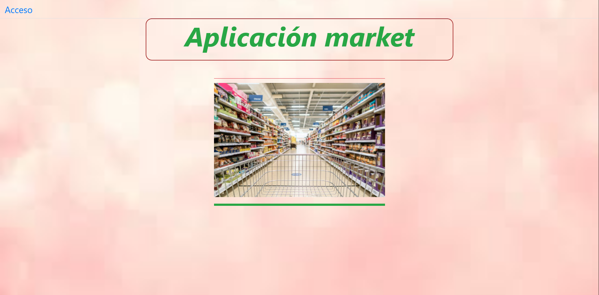
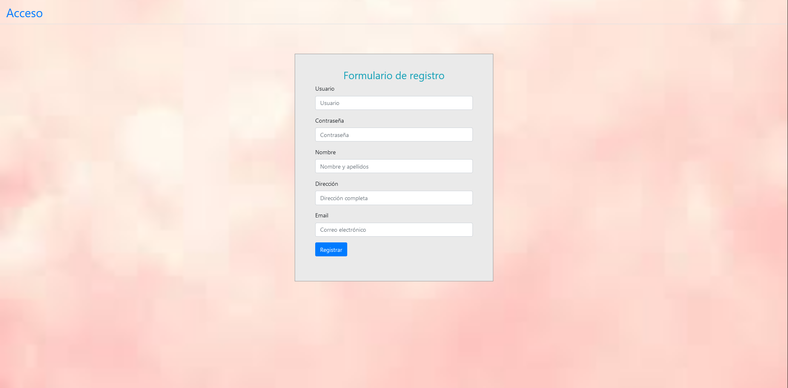
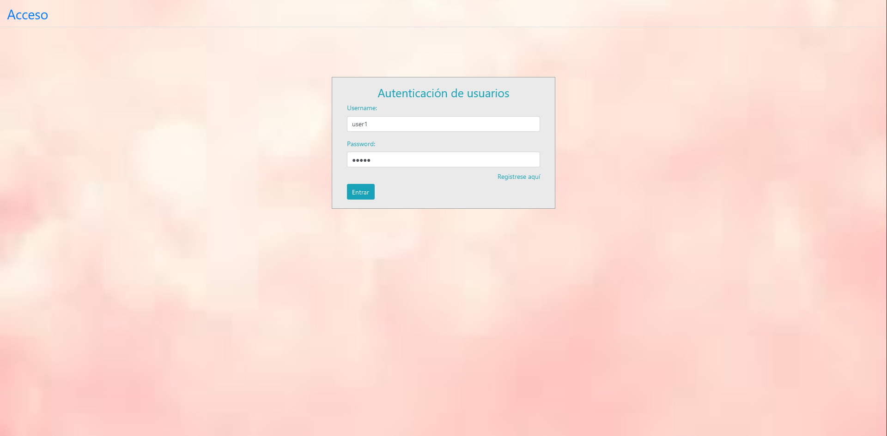
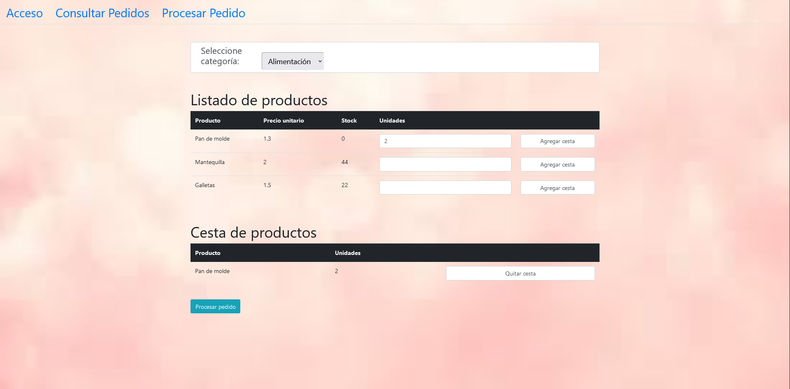

# Creación de una aplicación desde cero utilizando microservicios REST Java, Spring Boot y Angular

## Características

Esta es una sencilla aplicación full stack comprendida por: 
-Capa Back end / Spring Boot 3.3.1: Comprende los microservicios de clientes, pedidos y productos.
-Capa Front end / Angular 16.2.14

## Technologies 

- Angular 16.2.14
- css
- Bootstrap 4
- Typescript
- Gradle
- Hibernate
- Spring Boot 3.1.11
- Spring Data
- Spring core

## Interfaces 

### Home

### Registro

### Login

### Procesar Pedido

### Consultar Pedido

## Demo
[Link to video Demo](https://www.youtube.com/watch?v=gm6MtrvOHqY)
